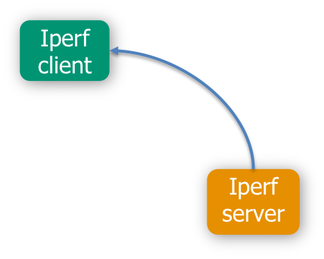

# Use case example: Iperf client - server
-----------------------------------------

In this page there is a full use case example explaining how the deployment process works, step-by-step. We assume that the NFVO and the Generic VNFM are running ready to receive invocations.

What is going to be deployed is shown in the following picture, an [Iperf][iperf] client and an Iperf server.



As shown in the picture, the iperf server is the source of the dependency and the client is the target. In this case the client need IP of the server. The semantics of the vnf dependency is: the source provides some parameters to the target.

Before starting we need to send the VimInstance to the NFVO and the Network Service Descriptor. For doing this please have a look into the [Vim instance documentation][vim-doc], [VNF Package documentation][vnf-package] and [Network Service Descriptor documentation][nsd-doc]. In fact, for creating a Network Service Record, we need to have a Network Service Descriptor loaded into the catalogue with two Virtual Network Functions (iperf client and server) created from a VNF Package. A Virtual Network Descriptor Json-File for Iperf client looks like this:

```json
{
    "vendor":"fokus",
    "version":"0.1",
    "name":"iperf-client",
    "type":"client",
    "endpoint":"generic",
    "vdu":[
        {
            "vm_image":[
                "ubuntu-14.04-server-cloudimg-amd64-disk1"
            ],
            "computation_requirement":"",
            "virtual_memory_resource_element":"1024",
            "virtual_network_bandwidth_resource":"1000000",
            "lifecycle_event":[

            ],
            "vimInstanceName":"vim-instance",
            "vdu_constraint":"",
            "high_availability":"ACTIVE_PASSIVE",
            "scale_in_out":2,
            "vnfc":[
                {
                    "connection_point":[
                        {
                            "virtual_link_reference":"private"
                        }
                    ]
                }
            ],
            "monitoring_parameter":[
                "cpu_utilization"
            ]
        }
    ],
    "virtual_link":[
        {
            "name":"private"
        }
    ],
    "connection_point":[

    ],
    "lifecycle_event":[
        {
            "event":"INSTANTIATE",
            "lifecycle_events":[
                "install.sh"
            ]
        },
        {
            "event":"CONFIGURE",
            "lifecycle_events":[
                "server_configure.sh"
            ]
        }
    ],
    "vdu_dependency":[

    ],
    "monitoring_parameter":[
        "cpu_utilization"
    ],
    "deployment_flavour":[
        {
            "df_constraint":[
                "constraint1",
                "constraint2"
            ],
            "costituent_vdu":[

            ],
            "flavour_key":"m1.small"
        }
    ],
    "manifest_file":""
}
```

This is a perfect example of a dependency. The VNFManager Generic, after creation of the client VNF described, will run the `install.sh` script during the instantiate method. The install.sh script is:

```bash
#!/bin/bash

sudo apt-get update && sudo apt-get install -y iperf screen
```

As said before in the documentation [VNFManager Generic][vnfm-generic], _the scripts in the CONFIGURE lifecycle event need to start with the type of the source VNF followed by \_ and the name of the script_, so the `server_configure.sh is:

```bash
#!/bin/bash

screen -d -m -S client iperf -c $server_private1 -t 300
```

These scripts showed above, are contained into the VNF Package or into a git repository accessible from the VM. Once all these steps are done we are ready to create a Network Service Record from the id of the Network Service Descriptor. 

Let's again have a look into the sequence diagram of a create Network Service Record operation.


When the Network Service Record create is called with the Iperf Network Service Descriptor's id, the steps defined in the sequence diagram above happen.

##### INSTANTIATE Method

The first message sent to the Generic VNFM is the INSTANTIATE message **(1)**. This message contains the VNF Descriptor and some other parameters needed to create the VNF Record, for instance the list of Virtual Link Records. The Generic VNFM  is called and then the create Virtual Network Function Record and the Virtual Network Function Record is created **(2)** and sent back to the NFVO into a GrantOperation message **(3)**. This message will trigger the NFVO to check if there are enough resources to create that VNF Record. If so, then a GrantOperation message with the updated VNF Record is sent back to the Generic VNFManager. Then the Generic VNFManager creates an AllocateResources message with the received VNF Record and sends it to the NFVO **(4)**. The NFVO after creating the Resources (VMs) sends back the AllocateResources message to the VNFManager. here the instantiate method is called **(5)**. Inside this method, the scripts (or the link to the git repository containing the scripts) contained into the VNF Package is sent to the EMS, the scripts are saved locally to the VM and then the Generic VNFManager will call the execution of each script defined in the VNF Descriptor **(6)**. Once all of the scripts are executed and there was any errors, the VNFManager sends back to the NFVO the Instantiate message **(7)**. 

##### MODIFY Method

If the VNF is target for some dependencies, like the iperf client, the MODIFY message is sent to the VNFManager by the NFVO **(8)**. Then the VNFManager executes the scripts contained into the CONFIGURE lifecycle event defined into the VNF Descriptor **(9)**, and sends back to the NFVO the modify message **(10)**, if no errors occurred. In this case, the scripts environment will contain the variables defined into the related VNF dependency.

##### START Method

Here exactly as before, the NFVO sends the START message to the Generic VNFManager **(11)**, and the VNFManager calls the EMS for execution of the scripts defined in the START lifecycle (none for this example) **(12)**. And the start message is then sent back to the NFVO meaning that no errors occurred **(13)**.

## Conclusions

When all the VNF Record are done with all the scripts defined in the lifecycle events, the NFVO will put the state of the VNF Record to ACTIVE and when all the VNF Records are in state ACTIVE, also the Network Service Record will be in state ACTIVE. This means that the service was correctly run. For knowing more about the states of a VNF Record please refer to [VNF Record state documentation][vnfr-states]

<!---
References
-->

[vnfr-states]:vnfr-states
[vnfm-generic]: vnfm-generic
[nsd-doc]:ns-descriptor
[vnf-package]:vnfpackage
[vim-doc]:vim-instance-documentation
[iperf]:https://iperf.fr

<!---
Script for open external links in a new tab
-->
<script type="text/javascript" charset="utf-8">
      // Creating custom :external selector
      $.expr[':'].external = function(obj){
          return !obj.href.match(/^mailto\:/)
                  && (obj.hostname != location.hostname);
      };
      $(function(){
        $('a:external').addClass('external');
        $(".external").attr('target','_blank');
      })
</script>